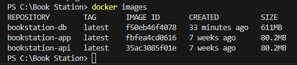

# Docker勉強会

- まえがき  
BookStationで学習もとい研修を行う上での問題点（**環境構築の面倒くささ**）を解消するために、**Docker**を使用して簡単に環境を作成できるようにしていきます。  
**※事前にBook StationがどのようなWebアプリケーションであるかを理解しておくと内容がすんなり入ってくると思います。**  
**※そもそもDockerって何？コンテナって何？という方でも環境構築できる資材は準備していますので、ぜひ読んでください。**

## 成果物
今回環境構築するために作成・編集したファイルは以下の通りです。  
以下のファイル群を用意して、Dockerコマンドを2回実行するだけで、サーバーの構築、起動までが完了します。

```
BookStation/
├── books/                   #booksリポジトリ
│   ├── backend
│   ├── front
│   └── :                    #省略
│   
└── books-container/         #本リポジトリ
    ├── db/
    │   └── init_db/
    │       └── test.sql     #初期データ登録用
    ├── docker/
    │   ├── api/
    │   │   └── Dockerfile   #apiコンテナ作成用
    │   ├── app/
    │   │   └── Dockerfile   #appコンテナ作成用
    │   └── db/
    │       ├── Dockerfile   #dbコンテナ作成用
    │       └── my.cnf       #MySQLの文字コード設定用
    ├── .env                 #MySQLで使用する環境変数を記述
    └── docker-compose.yml   #dockercomposeファイル
```

次の章からコンテナ環境の作成手順をファイル毎に説明していきます。

## コンテナ作成手順
### appコンテナ作成
まずはBookStationを構成するWebサーバの部分のコンテナから作成/定義していきます。

**/BookStation/books-container/docker/app/Dockerfile**
```docker
FROM node:12.13-alpine

WORKDIR /app

```

FROM句では、コンテナのベースイメージを決定しています。（今回はalpine上で動作するnode.js v12.13を選んでいます。）

WORKDIR句では、コンテナ内のどこで処理を行うかpathを指定しています。今回の場合、立ち上がったappコンテナ内の`/app`以下でそれ以降の処理が行われる、ということになります。  
※今回RUN句などの後続処理を用意をしていないため、WORKDIR句自体不要でありますが、今後やりたい事ができたとき用に指定だけしておきます。

以下は、`docker-compose.yml`のappコンテナの定義になります。  
パッケージを用意するための`npm install`と、サーバーを起動するためのコマンドをコンテナ起動時に代わりに実行してもらいます。  
※node_moduleフォルダの有無を確認し、フォルダが存在しないときのみ`npm install`コマンドが実行されるようにしているため、コンテナ起動毎にインストールが行われることはありません。

**/BookStation/books-container/docker-compose.yml**
```yml
  app:
    container_name: app_container   # コンテナ名
    build: ./docker/app             # Dockerfileの配置場所
      ports:
      - 8080:8080                   # ポートフォワーディングの設定
      volumes:
      - ../books/front:/app         # Vueプロジェクトのfrontフォルダとコンテナ内のappをマウント
    stdin_open: true                # ホストマシンの入力をコンテナに伝えるための記述
    tty: true                       # プロセスが終了した際に、コンテナを終了させないための記述
      environment:
      TZ: Asia/Tokyo                # タイムゾーンを変更
    command: >                      # コンテナ起動時に実行するコマンド
        /bin/sh -c "[ -d node_modules ] 
        || npm install || true && npm run serve"
      networks:
      - default                     # コンテナ間で通信のために使用するネットワークを明示
```

### apiコンテナ作成
次に、BookStationを構成するAPIサーバの部分のコンテナを作成/定義していきます。  
とは言え、イメージの作成まではappコンテナとほぼ同じものになります。

**/BookStation/books-container/docker/api/Dockerfile**
```docker
FROM node:12.13-alpine

WORKDIR /api

```

FROM句では、コンテナのベースイメージを決定しています。（appコンテナ同様に、alpine上で動作するnode.js v12.13を選んでいます。）

WORKDIR句では、コンテナ内のどこで処理を行うかpathを指定しています。今回の場合、立ち上がったapiコンテナ内の`/api`以下でそれ以降の処理が行われる、ということになります。  
※今回RUN句などの後続処理を用意をしていないため、WORKDIR句自体不要でありますが、今後やりたい事ができたとき用に指定だけしておきます。

以下は、`docker-compose.yml`のapiコンテナの定義になります。  
こちらもappコンテナ同様、パッケージを用意するための`npm install`と、サーバーを起動するためのコマンドをコンテナ起動時に代わりに実行してもらいます。

**/BookStation/books-container/docker-compose.yml**
```yml
  api:
    container_name: api_container   # コンテナ名
    build: ./docker/api             # Dockerfileの配置場所
    ports:
      - 3000:3000                   # ポートフォワーディングの設定
    volumes:
      - ../books/backend:/api       # Vueプロジェクトのfrontフォルダとコンテナ内のappをマウント
    tty: true                       # プロセスが終了した際に、コンテナを終了させないための記述
    environment:
      CHOKIDAR_USEPOLLING: 1        # ホットリロードの有効化
      TZ: Asia/Tokyo                # タイムゾーンを変更
    depends_on:
      - db                          # dbが起動した後にapiを起動するための指定
    command: >                      # コンテナ起動時に実行するコマンド
      /bin/sh -c "[ -d node_modules ] 
      || npm install || true && npm run start"
    networks:
      - default                     # コンテナ間で通信のために使用するネットワークを明示
```

上記のコンテナの作成に加えて、AppサーバとAPIサーバ間の通信を実現するために、`vue.config.js`を編集します。  
devserver > proxy > /api > target の値を`http://api:3000`とします。  
（もともとは`http://localhost:3000`）

**/BookStation/books/front/vue.config.js**（一部抜粋）
```js
  devServer: {
    https: true,
    port: 8080,
    proxy: {
      '/api': {
        target: "http://api:3000",
        changeOrigin: true,
      }
    }
  }
```

これは、BookStationの実行環境の違いによるものが原因となっています。

これまでの実行環境は、ホストPC内でサーバを起動していました。そのため、3000番ポートへのアクセスはlocalhostからそのままアクセス可能でした。  
ただし、今回はそれぞれ独立したコンテナが3つ起動しているため、Appサーバがlocalhost:3000を参照しても、Appコンテナ内の3000番ポートを参照してしまう。といった状況になるのです。


では、何を指定することでAPIコンテナと通信することができるのか。という問題になると思います。  
これはかなり都合の良い話なのですが、Docker-composeを使用して立ち上げたコンテナはデフォルトで、サービス名を指定するだけでアクセス可能となります。（Docker様々。。！）  
今回の場合、`docker-compose.yml`で記載した「`api`」を指定するだけで通信が行えます。

**/BookStation/books-container/docker-compose.yml**
```yml
  api:                              # サービス名はここ！
    container_name: api_container
    build: ./docker/api
    ports:
      - 3000:3000

# ～中略～
```

#### 補足（2025/04/13追記）
これまでの実装の問題点として、frontendソースのホットリロードが実行されないという問題点がありました。  
コンテナを使用していない環境の場合は自動でコンパイルが走っていましたが、コンテナ環境の場合は別途設定が必要になります。

vue.config.jsに以下の設定を追記します。  
**/BookStation/books/front/vue.config.js**（一部抜粋）
```js
  devServer: {
    https: true,
    port: 8080,
    proxy: {
      '/api': {
        target: "http://api:3000",
        changeOrigin: true,
      }
    },
    watchOptions: {               // 追記箇所
      ignored: /node_modules/,
      poll: true
    }
  }
```

今回追記した`watchOptions`という設定は、ソースコードの更新状況を監視して都度コンパイルを実行してくれるものになります。  
また、コンパイルの短縮のために`ignored`を設定して監視範囲を絞り、開発の効率化を図っています。

`watchOptions`の詳細は、以下のリンクを参考にしてください。  
[watchOptionsの詳細](https://webpack.js.org/configuration/watch/)

### dbコンテナ作成
最後にDBサーバのコンテナを作成/定義していきます。

**/BookStation/books-container/docker/db/Dockerfile**
```docker
FROM mysql:8.0.39-debian

EXPOSE 3306

CMD ["mysqld"]

ADD ./my.cnf /etc/mysql/conf.d/my.cnf

RUN chmod 644 /etc/mysql/conf.d/my.cnf
```

FROM句では、コンテナのベースイメージを決定しています。（今回はdebian上で動作するmysql:8.0.39を選んでいます。）

EXPOSE句では、コンテナのポートを公開していることをDockerに伝えます。実際には不要とされることが多いコマンドではありますが、明示する意味も込めて記載する場合があるそうです。

CMD句では、`mysqld`を実行します。（デーモンの起動。MySQLを使用するためのおまじない程度に考えています。）

ADD句では、MySQLの文字コードを設定しているファイルを指定のフォルダにコピーします。  
DB操作する際に文字化けしないように明示してあげます。

RUN句では、その設定ファイルに対して適切な権限を付与します。  
**設定ファイルが作成者以外からも書き込み可能になっていると、この設定ファイルが機能しないので要注意！！**

以下は、`Docker-compose.yml`のappコンテナの定義になります。  
コマンドの登録はありませんが、初期提供データの設定を記述しています。

**/BookStation/books-container/docker-compose.yml**
```yml
  db:
    container_name: db_container                        # コンテナ名
    build: ./docker/db                                  # Dockerfileの配置場所
    ports:
      - 3306:3306                                       # ポートフォワーディングの設定
    volumes:
      - ./db/init_db:/docker-entrypoint-initdb.d        # 初期データ投入用のsqlファイルをバインド
      - test_data:/var/lib/mysql                        # 永続化したデータをバインド
    environment:
      - MYSQL_DATABASE=${MYSQL_DATABASE}                # コンテナの環境変数から各種設定を読み込み
      - MYSQL_USER=${MYSQL_USER}
      - MYSQL_PASSWORD=${MYSQL_PASSWORD}
      - MYSQL_ROOT_PASSWORD=${MYSQL_ROOT_PASSWORD}
      - TZ="Asia/Tokyo"
    networks:
      - default                                         # コンテナ間で通信のために使用するネットワークを明示
```

上記のdocker-compose.ymlで使用している`.env`は以下の通りです。  
DBの名前やアカウントの情報を別ファイルで管理することで、docker-compose.ymlに直書きすることを防いでいます。

**/BookStation/books-container/.env**
```
MYSQL_DATABASE=intern
MYSQL_USER=intern
MYSQL_PASSWORD=intern
MYSQL_ROOT_PASSWORD=intern
```

MySQLへの接続を実現するために、`vue.config.js`を編集します。  
APIサーバへのアクセス時の同様に、localhostではdbコンテナにアクセスできないため、サービス名を指定してDBとのやり取りを実現させます。

**/BookStation/books/backend/db/utility.js**
```js
const Sequelize = require("sequelize");

/**
* DBコネクション取得
* @returns DBコネクション
*/
module.exports.connect = function () {
  return new Sequelize("intern", "intern", "intern", {
    dialect: "mysql",
    host: "db",
    port: 3306,
    pool: {
      max: 5,
      min: 1,
      acquire: 30000,
      idle: 10000
    }
  });
}
```

上記の設定でdbコンテナの作成はほぼ完了となります。  
後は、初期提供データを投入するためのクエリと文字コードなどの設定ファイルを用意して完了となります。

初期提供データのほうは割愛しますが、MySQLの設定ファイルは以下のようになっています。

**/BookStation/books-container/docker/db/my.cnf**
```
[mysqld]
character-set-server=utf8mb4
collation-server=utf8mb4_0900_ai_ci

[mysql]
default-character-set=utf8mb4

[client]
default-character-set=utf8mb4
```

この設定ファイルを適用するために、DockerfileのADD句以降の処理が必要でした。

## コンテナイメージの作成
ここまでの手順で環境構築に必要なDockerfileと、docker-compose.ymlが完成しました。  
設計図は出揃ったので、早速コンテナイメージの作成に取り掛かります。

とは言っても、以下のコマンドを実行するだけでコンテナイメージの作成は完了します。

```Shell
docker-compose build
```

実行が完了したら、イメージがちゃんと作成できているか以下のコマンドでチェックします。

```Shell
docker images
```

以下の様に3つのコンテナイメージが確認できていればOKです。


## コンテナの作成
最後に以下のコマンドを実行して、コンテナイメージをコンテナ化します。

```Shell
docker-compose up -d
```

実行が完了したら、コンテナがちゃんと作成できているか以下のコマンドでチェックします。

```Shell
docker ps
```

以下の様に3つのコンテナが確認できていればOKです。


ちなみにコンテナイメージ、起動したコンテナについてはDocker Desktopからも確認可能です。

**起動したコンテナ**


**作成したコンテナイメージ**


## 動作確認
後はいつも通りBook Stationにアクセスしてみましょう。アクセスするためのpathは以下の通りです。
```
https://localhost:8080/public/pages/signin.html
```

ちゃんと初期提供データ登録用のSQLが実行できているみたいでよかったです！


最後にアプリを終了する際には、以下のコマンドを実行してください。
```docker
docker-compose stop
```

## まとめ
今回は、仮想化技術（Docker）を使用して環境構築の簡易化を実践してみました。  
設計図（Dockerfile,docker-compose.yml）を作成するまではとても大変でしたが、一度作成してしまえば複数台のPCに対して、一瞬で環境構築ができてしまうのがとても大きなメリットとなっています。  
また、それらのPC毎に環境差異が全くないことも大きな特徴となっています。（インターンで使えないかな。。）

## Dockerでの環境構築に挑戦する方へ
以下に環境構築の手順を簡単に記載しておきますので、やってみたい方は是非！

1. リポジトリのクローン

    PCに以下のリポジトリのクローンを作成してください。
    |ブランチ|リポジトリ|
    |--|--|
    |books|docker/docker-compose|
    |books-container|master|

    以下の配置になっていればOKです。（ルートディレクトリの名前は適当です）
    ```
    BookStation/
    ├── books/                   #booksリポジトリ
    │   ├── backend
    │   ├── front
    │   └── :                    #省略
    │   
    └── books-container/         #本リポジトリ
        ├── db/
        │   └── init_db/
        │       └── test.sql     #初期データ登録用
        ├── docker/
        │   ├── api/
        │   │   └── Dockerfile   #apiコンテナ作成用
        │   ├── app/
        │   │   └── Dockerfile   #appコンテナ作成用
        │   └── db/
        │       ├── Dockerfile   #dbコンテナ作成用
        │       └── my.cnf       #MySQLの文字コード設定用
        ├── .env                 #MySQLで使用する環境変数を記述
        └── docker-compose.yml   #dockercomposeファイル
    ```

2. ソースコードの修正

    Booksリポジトリのソースコードはコンテナを想定した実装になっていないため、以下の修正を実施してください。

    **/BookStation/books/front/vue.config.js**（一部抜粋）
    ```js
      devServer: {
        https: true,
        port: 8080,
        proxy: {
          '/api': {
            target: "http://api:3000",  // 修正箇所
            changeOrigin: true,
          }
        },
        watchOptions: {                 // 追記箇所
          ignored: /node_modules/,
          poll: true
        }
      }
    ```

    **/BookStation/books/backend/db/utility.js**
    ```js
    const Sequelize = require("sequelize");

    /**
    * DBコネクション取得
    * @returns DBコネクション
    */
    module.exports.connect = function () {
      return new Sequelize("intern", "intern", "intern", {
        dialect: "mysql",
        host: "db",         // 修正箇所
        port: 3306,         // 追記箇所
        pool: {
          max: 5,
          min: 1,
          acquire: 30000,
          idle: 10000
        }
      });
    }
    ```

3. コンテナ管理ツールのインストール

    以下からDocker Desktopインストールしてください。（ライセンス違反になるほう）
    ```
    https://docs.docker.com/desktop/install/windows-install/
    ```
    Rancher Desktopを使用する場合はこちら（ライセンス違反にならないほう）
    ```
    https://rancherdesktop.io/
    ```

4. コンテナイメージの作成

    インストール完了後、コマンドプロンプトで以下のコマンドを実行してください。  
    **※ docker-compose.ymlが配置されている階層で実行してください**
    ```
    cd C:\BookStation\books-container

    docker-compose build
    ```

5. コンテナの作成・起動

    最後に以下のコマンド実行すればBookStationに一定時間後にアクセスが可能となります。
    ```
    docker-compose up -d
    ```

6. コンテナの停止

    コンテナを停止したい場合は、以下のコマンドを実行してください。
    ```
    docker-compose stop
    ```
