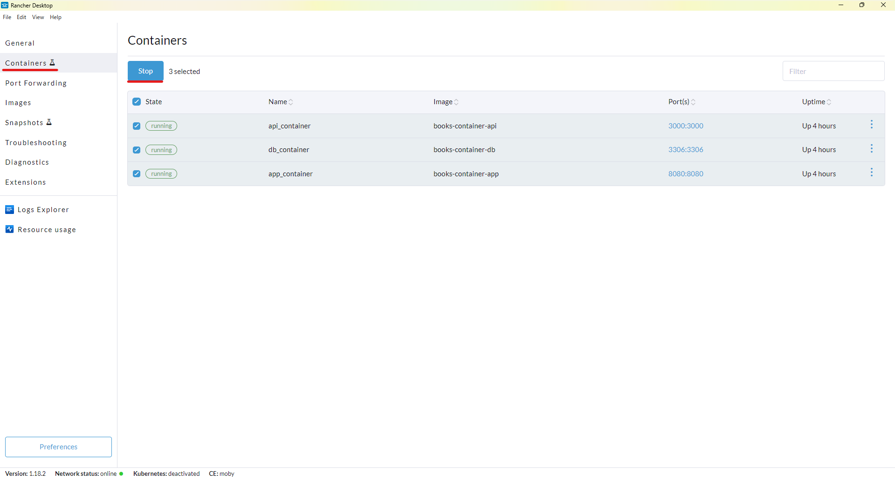
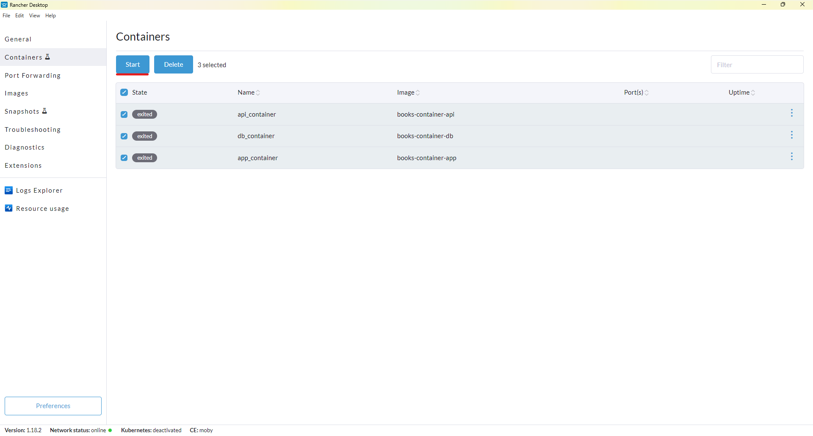
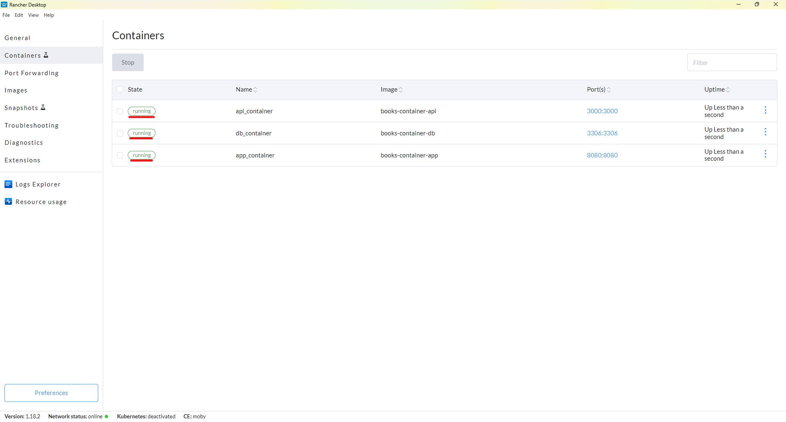
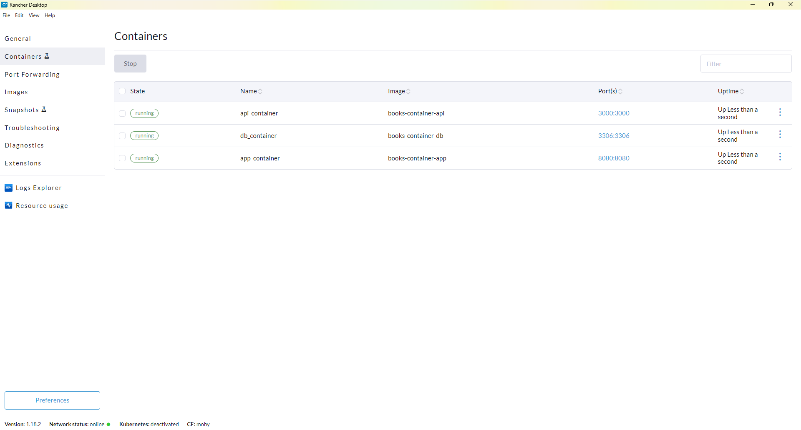
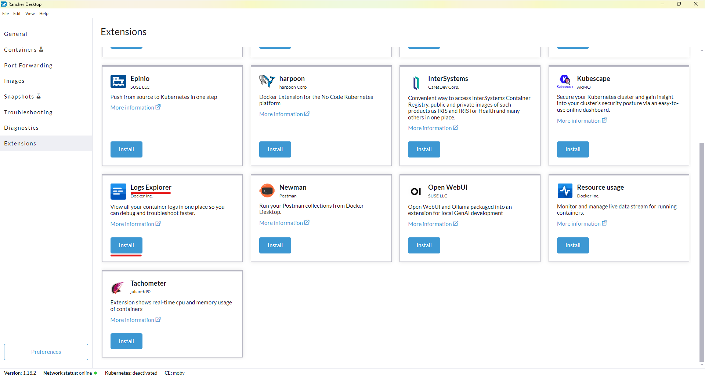
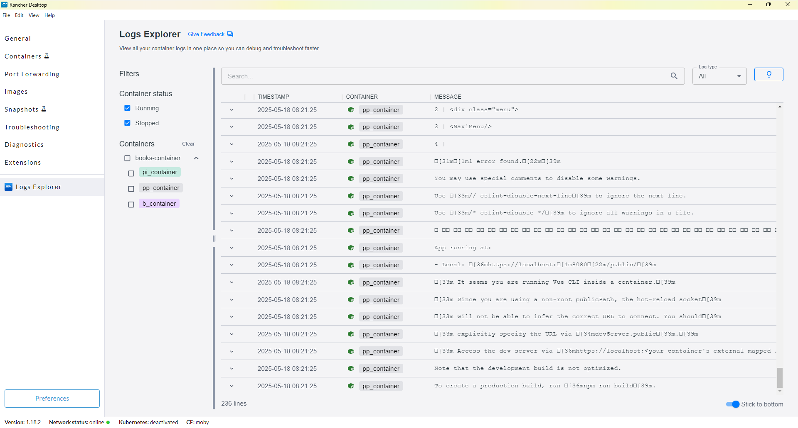
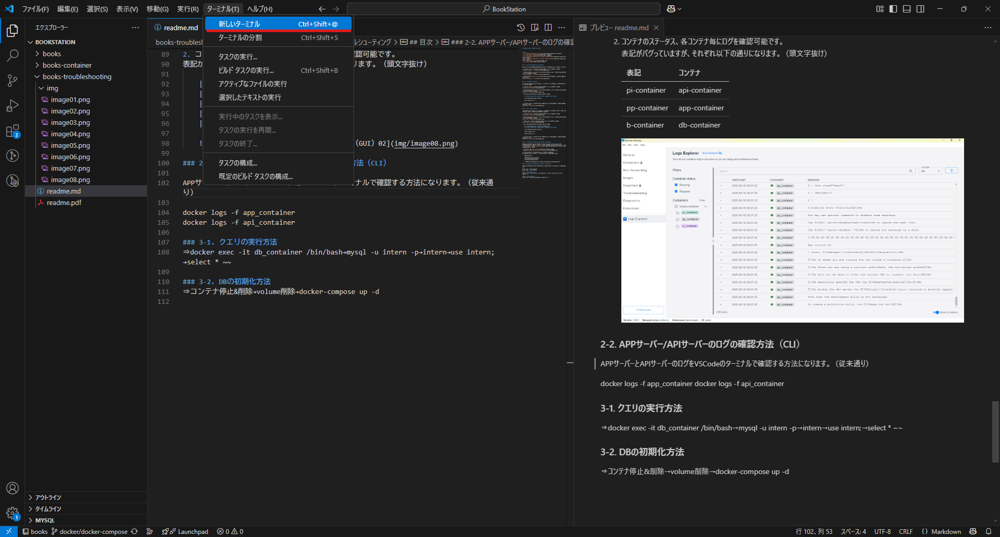
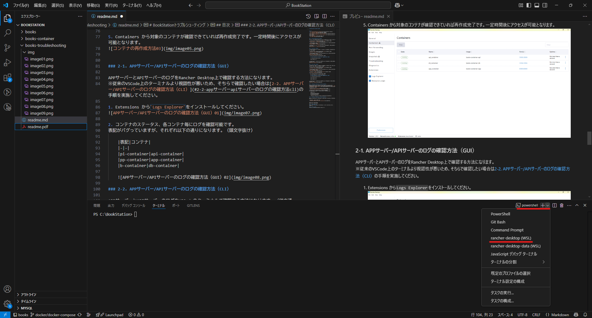

# BookStationトラブルシューティング

BookStationの環境構築をコンテナを用いて実施した際にご利用いただけるトラブルシューティングになります。  
目次から各項目の手順にジャンプできます。

## 目次
- [1-1. サーバー（コンテナ）の再起動方法](#1-1-サーバーコンテナの再起動方法)
- [1-2. コンテナの再作成方法](#1-2-コンテナの再作成方法)
- [1-3. イメージの再作成方法](#1-3-イメージの再作成方法)
- [2-1. APPサーバー/APIサーバーのログの確認方法（GUI）](#2-1-appサーバーapiサーバーのログの確認方法gui)
- [2-2. APPサーバー/APIサーバーのログの確認方法（CLI）](#2-2-appサーバーapiサーバーのログの確認方法cli)
- [3-1. クエリの実行方法](#3-1-クエリの実行方法)
- [3-2. DBの初期化方法](#3-2-dbの初期化方法)


### 1-1. サーバー（コンテナ）の再起動方法

サーバーの調子がおかしい、起動しないなどのトラブル時にサーバーの再起動を行ってください。

1. Containers から対象のコンテナをチェックして`Stop`を押下してください。


2. コンテナのステータスが`exited`になっていることを確認後、対象のコンテナをチェックして`Start`を押下してください。


3. コンテナのステータスが`running`になっていれば再起動完了です。一定時間後にアクセスが可能となります。



### 1-2. コンテナの再作成方法

1.1のサーバー（コンテナ）の再起動を行ったが状況が変わらないといった場合にコンテナの再作成を行ってください。

1. 以下のコマンドを実行してコンテナを削除します。  
    **※ docker-compose.ymlが配置されている階層で実行してください**
    ```
    cd C:\BookStation\books-container

    docker-compose down
    ```

2. コンテナ削除後、以下のコマンドを実行してコンテナを再作成します。
    ```
    docker-compose up -d
    ```

3. Containers から対象のコンテナが確認できていれば再作成完了です。一定時間後にアクセスが可能となります。



### 1-3. イメージの再作成方法

1.2のコンテナの再作成を行ったが状況が変わらないといった場合にイメージの再作成を行い、作り直したイメージを基にコンテナを作成してください。

1. 以下のコマンドを実行してコンテナを削除します。  
    **※ docker-compose.ymlが配置されている階層で実行してください**
    ```
    cd C:\BookStation\books-container

    docker-compose down
    ```

2. 以下のコマンドを実行してイメージを削除します。
    ```
    docker image rm books-container-db books-container-api books-container-app
    ```

3. イメージ削除後、以下のコマンドを実行してイメージとコンテナの再作成を行います。
    ```
    docker-compose build

    docker-compose up -d
    ```

4. Containers から対象のコンテナが確認できていれば再作成完了です。一定時間後にアクセスが可能となります。


### 2-1. APPサーバー/APIサーバーのログの確認方法（GUI）

APPサーバーとAPIサーバーのログをRancher Desktop上で確認する方法になります。  
※従来のVSCode上のターミナルより視認性が悪いため、そちらで確認したい場合は[2-2. APPサーバー/APIサーバーのログの確認方法（CLI）](#2-2-appサーバーapiサーバーのログの確認方法cli)の手順を実施してください。

1. Extensions から`Logs Explorer`をインストールしてください。


2. コンテナのステータス、各コンテナ毎にログを確認可能です。  
表記がバグっていますが、それぞれ以下の通りになります。（頭文字抜け）  

    |表記|コンテナ|
    |-|-|
    |pi-container|api-container|
    |pp-container|app-container|
    |b-container|db-container|

    


### 2-2. APPサーバー/APIサーバーのログの確認方法（CLI）

APPサーバーとAPIサーバーのログをVSCodeのターミナルで確認する方法になります。（従来通り）  

1. VSCodeからターミナルを開きます。


2. ターミナルから`Rancher Desktop（WSL）`を選択して以下のコマンドを実行するとAPPサーバーのログが表示されます。
    ```
    docker logs -f app_container
    ```
    

3. 新しいターミナル`Rancher Desktop（WSL）`を開き、2. 同様に以下のコマンドを実行するとAPIサーバーのログが表示されます。
    ```
    docker logs -f api_container
    ```


### 3-1. クエリの実行方法

ロジックを経由せず、直接テーブルを更新したい場合に以下の手順からクエリを実行してください。

1. 以下のコマンドを実行してDBコンテナにアクセスします。
    ```
    docker exec -it db_container /bin/bash
    ```

2. 以下のコマンドを実行してMySQLDBに接続します。  
※実行後にパスワードを求められますので`intern`と入力してください。
    ```
    mysql -u intern -p
    ```

3. 以下のコマンドを実行して使用するDBを選択してください。  
DB選択後にSQLを実行可能となります。
    ```
    use intern;
    ```


### 3-2. DBの初期化方法

DBに不具合があり、初期化を行いたい場合やレコードを初期状態に戻したい場合に以下の手順を実施してください。  
**※一度初期化するとデータを元の状態に戻すことはできません。**

1. 以下のコマンドを実行してコンテナを削除します。  
    **※ docker-compose.ymlが配置されている階層で実行してください**
    ```
    cd C:\BookStation\books-container

    docker-compose down
    ```

2. コンテナ削除後、以下のコマンドを実行してDBのデータを保持しているボリュームを削除します。
    ```
    docker volume rm books-container_test_data
    ```

3. コンテナとボリュームを削除後、以下のコマンドを実行してコンテナとボリュームを再作成します。
    **※ docker-compose.ymlが配置されている階層で実行してください**
    ```
    docker-compose up -d
    ```


